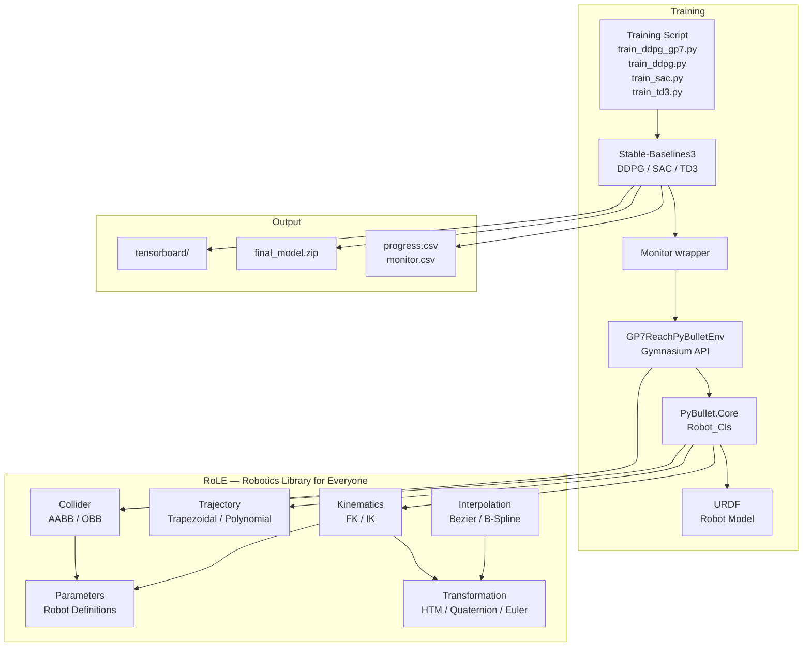

# DRL Robot Manipulator — Yaskawa GP7

Deep Reinforcement Learning training and evaluation framework for the **Yaskawa GP7** robotic arm, using **PyBullet** for physics simulation, **Gymnasium** for the environment API, and **Stable-Baselines3** for DRL algorithm implementations.

---

## Project Overview

The project trains DRL agents (DDPG, SAC, TD3) to solve a **robotic reaching task**: moving the TCP (tool centre point) from a home configuration to a randomly sampled target position in the robot's configuration space. Two environment modes are available:

| Mode | Description |
|------|-------------|
| `Default` | Free-space reaching — no obstacle |
| `Collision-Free` | Reaching with a 0.1 m cube obstacle that the policy must navigate around |

The architecture separates concerns cleanly: PyBullet provides physics and rendering; a Gymnasium environment wraps the robot and exposes the RL interface; Stable-Baselines3 trains the policy; and a custom robotics library (RoLE) handles kinematics, transformations, and collision geometry.

---

## Architecture



---

## Repository Structure

```
DRL_Robot_Manipulator/
├── src/
│   ├── config_loader.py           # Project root resolver (finds config.yaml)
│   ├── Industrial_Robotics_Gym/
│   │   ├── __init__.py            # Gymnasium env registration
│   │   ├── Utilities.py           # Environment ID builder
│   │   └── Environment/
│   │       ├── GP7ReachPyBulletEnv.py  # Active Gym env (PyBullet-backed)
│   │       └── Core.py             # Legacy Gym env (unused by training)
│   ├── PyBullet/
│   │   ├── Core.py                # Robot_Cls — PyBullet robot interface
│   │   ├── Utilities.py           # Wireframe, environment structure lookup
│   │   └── Configuration/
│   │       └── Environment.py      # Dataclasses for env/collision parameters
│   └── RoLE/                      # Robotics Library for Everyone
│       ├── Parameters/Robot.py      # DH params, joint limits, collider defs
│       ├── Transformation/Core.py    # HTM, Vector3, Quaternion, EulerAngle
│       ├── Kinematics/Core.py      # FK, IK (JT / NR / GN / LM)
│       ├── Collider/Core.py        # AABB, OBB collision detection
│       ├── Primitives/Core.py       # Point, Line, Box primitives
│       ├── Trajectory/              # Trapezoidal, polynomial profiles
│       └── Interpolation/           # Bezier, B-Spline curves
├── Training/
│   ├── train_ddpg_gp7.py          # DDPG, Default mode, 800k steps
│   ├── train_ddpg.py              # DDPG, Collision-Free, 100k steps
│   ├── train_sac.py              # SAC, Collision-Free, 100k steps
│   └── train_td3.py             # TD3, Collision-Free, 100k steps
├── Evaluation/
│   ├── Gym/
│   │   ├── Model/Prediction/     # Predict paths with trained models
│   │   └── Model/Training/       # Visualise training progress
│   └── PyBullet/
│       └── Control/              # IK validation, config space tests
├── Data/                         # Training outputs (gitignored)
├── URDFs/                        # Robot URDF, primitives, viewpoint
├── Textures/                     # Plane texture (gitignored)
├── config/
│   └── config.yaml               # PROJECT_FOLDER_NAME
├── docker/                       # Dockerfile, compose files
└── requirements.txt             # Pinned dependencies
```

---

## Installation

### Prerequisites

| Component | Version | Notes |
|-----------|---------|-------|
| Python | 3.10 or 3.11 | Tested on 3.10 |
| CUDA | 11.8 or 12.x | Optional — for GPU training |

### Steps

```bash
# 1. Clone / navigate to project root
cd DRL_Robot_Manipulator

# 2. Create virtual environment (recommended)
python -m venv .venv
# Windows:
.venv\Scripts\activate
# Linux/macOS:
source .venv/bin/activate

# 3. Install PyTorch with CUDA 12.1 support (GPU training)
pip install torch==2.2.2 torchvision==0.17.2 torchaudio==2.2.2 \
    --index-url https://download.pytorch.org/whl/cu121

# 4. Install remaining dependencies
pip install -r requirements.txt

# 5. Verify installation
python -c "import gymnasium; import stable_baselines3; import pybullet; print('OK')"
```

> **Important:** On Windows, running `pip install -r requirements.txt` alone installs the CPU-only PyTorch wheel. Always run the CUDA wheel installation command first.

---

## Running Training

From the project root directory:

```bash
# Default mode, GUI enabled, 800k steps (main training script)
python Training/train_ddpg_gp7.py

# Collision-Free mode, GUI enabled, 100k steps
python Training/train_ddpg.py

# Collision-Free mode, SAC, 100k steps
python Training/train_sac.py

# Collision-Free mode, TD3, 100k steps
python Training/train_td3.py

# Headless (no GUI window — faster training)
# Edit the script and set: ENABLE_GUI = False
```

Each run produces a timestamped output directory:

```
Data/Training/Environment_{MODE}/{ALGORITHM}/YASKAWA_GP7/run_{TIMESTAMP}/
├── config.json           # Experiment configuration
├── model/
│   └── final_model.zip  # Saved policy (SB3 native format)
└── logs/
    ├── progress.csv    # SB3 training metrics
    ├── monitor.csv     # Episode rewards and lengths
    └── time.txt         # Elapsed training time
```

---

## Environment Design

### Action Space

`Box(-1.0, 1.0, shape=(3,))` — normalised 3-D Cartesian TCP delta `[dx, dy, dz]`.

The environment scales the action by `action_step` (default 0.01 m) to produce an actual Cartesian displacement per step.

### Observation Space

`Box(-inf, inf, shape=(15,))` — 15-dimensional flat vector:

| Index | Field | Description |
|-------|-------|-------------|
| 0–2 | `tcp_x/y/z` | Current TCP position (world frame, m) |
| 3–5 | `target_x/y/z` | Current target position (world frame, m) |
| 6–8 | `err_x/y/z` | Target minus TCP position (m) |
| 9–11 | `rel_obs_x/y/z` | Obstacle position relative to TCP (zero in Default mode) |
| 12–14 | `obs_size_x/y/z` | Obstacle half-extents (zero in Default mode) |

### Reward

| Event | Reward |
|-------|--------|
| Every step | `−euclidean_distance(tcp, target)` |
| Truncation (workspace / IK / joint limit) | `−1.0` (plus step reward) |
| Collision with obstacle | `−5.0` (plus truncation) |

### Termination / Truncation

| Flag | Trigger |
|------|---------|
| `terminated = True` | TCP within 0.01 m (1 cm) of target |
| `truncated = True` | Workspace violation, IK failure, joint limit breach, obstacle collision, or step limit (200) reached |

---

## Environment Modes

Switch modes by changing `CONST_ENV_MODE` at the top of a training script:

```python
CONST_ENV_MODE = 'Default'         # No obstacle
CONST_ENV_MODE = 'Collision-Free'   # Cube obstacle present
```

---

## TensorBoard

TensorBoard logging is enabled automatically when `tensorboard` is installed. View logs:

```bash
tensorboard --logdir Data/Training/
```

---

## Evaluation Scripts

| Script | Purpose |
|--------|---------|
| `Evaluation/Gym/Model/Prediction/Static/predict_ddpg.py` | Run DDPG policy to a fixed target, save trajectory |
| `Evaluation/Gym/Model/Prediction/Random/predict_ddpg.py` | Run DDPG for 100 random targets, save metrics |
| `Evaluation/Gym/Model/Training/show_train_results.py` | Plot a single algorithm's training progress |
| `Evaluation/Gym/Model/Training/show_train_comparison.py` | Compare all 6 algorithm variants |
| `Evaluation/PyBullet/Control/test_configuration_space_rand.py` | Validate IK on random config-space targets |
| `Evaluation/PyBullet/Control/test_configuration_space_vertices.py` | Validate IK on all config-space corner vertices |

---

## Troubleshooting

### PyBullet GUI on Windows

PyBullet GUI works natively on Windows using native OpenGL. If the window fails to open:

1. Ensure your graphics drivers are up to date.
2. On Nvidia Optimus laptops, set the Nvidia GPU as the default for `python.exe`.
3. Run headless (`ENABLE_GUI = False`) if display is unavailable.

### GPU Not Detected

```python
import torch
print(torch.cuda.is_available())   # Should be True with CUDA wheels
print(torch.version.cuda)            # Should be '12.1'
```

If False, reinstall PyTorch with the CUDA index URL:

```bash
pip install torch==2.2.2 --index-url https://download.pytorch.org/whl/cu121
```

### Module Import Errors

Ensure you run from the project root directory, or that `src/` is in `PYTHONPATH`. The training scripts automatically add `src/` to `sys.path` relative to their own location.

### URDF Mesh Not Found

Some URDF files reference mesh paths that differ between Windows and Linux path conventions. The `Evaluation/URDFs/Robots/YASKAWA_GP7/a.py` script resolves these paths automatically.

---

## Development Notes

- **No fork-based multiprocessing:** All training uses `DummyVecEnv` (single-process). The `if __name__ == '__main__'` guard is present in all scripts.
- **Seeding:** All four random sources (Python `random`, NumPy, PyTorch, Gymnasium env) are seeded with `SEED = 42`.
- **SB3 logger:** Configured with `['stdout', 'csv']` + optional `'tensorboard'`.
- **HER variants** (DDPG_HER, SAC_HER, TD3_HER) are referenced in data paths and comparison scripts but the training scripts do not yet exist on disk.
- **Success threshold:** Throughout the codebase, `distance < 0.01` (1 cm) is used as the success criterion.

---

## Suggested Improvements

- Add HER (Hindsight Experience Replay) training scripts using SB3's `HerReplayBuffer`.
- Replace hardcoded `device='cuda'` with `torch.cuda.is_available()` check.
- Use `pathlib.Path` consistently for all path operations instead of `os.getcwd().split()`.
- Add automated pytest tests using `stable_baselines3.common.env_checker.check_env`.

---

## License

MIT License — Copyright (c) 2024 Roman Parak
